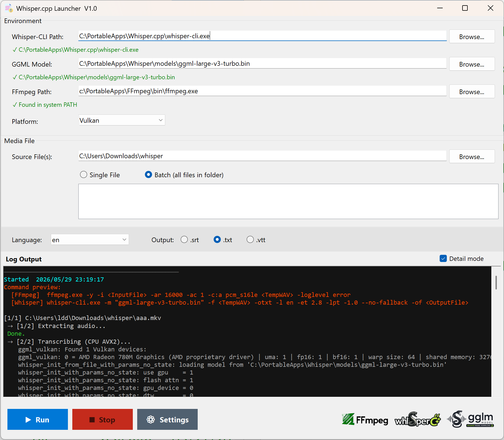

<div align="center">

# Whisper.cpp Launcher

**A dual-mode launcher for [whisper.cpp](https://github.com/ggml-org/whisper.cpp) — GUI and CLI, sharing one config file.**

&nbsp;&nbsp;&nbsp;
&nbsp;&nbsp;&nbsp;


</div>

---

## Overview

**Whisper.cpp Launcher** provides two complementary frontends for batch audio/video transcription using the [whisper.cpp](https://github.com/ggml-org/whisper.cpp) engine:

| Component | Type | Description |
|-----------|------|-------------|
| **WhisperGUI.exe** | Windows Forms (.NET 8) | Point-and-click interface for interactive use |
| **whispercli.exe** | Win32 Console (C++14) | Scriptable CLI for automation and batch jobs |

Both tools read from and write to the **same `config.ini`** file, so settings configured in the GUI are instantly available to the CLI and vice versa.

---

## Screenshot



---

## Features

- **Batch transcription** — process a single file or an entire folder in one run
- **Three output formats** — `.srt` (subtitles with timestamps), `.txt` (plain text), `.vtt` (WebVTT)
- **Multi-platform GPU acceleration** — Vulkan, CUDA, OpenVINO, and CPU AVX2
- **Fully parameterised** — every flag passed to `whisper-cli` and `ffmpeg` is editable in `config.ini`; no recompile needed
- **Shared configuration** — GUI and CLI share a single `config.ini`; set once, use both
- **Sleep prevention** — keeps Windows awake during long transcription jobs
- **Detail mode** (GUI) — streams `whisper-cli` stderr live into the log panel
- **Heartbeat dots** (CLI) — prints `.` every 5 s so you know the process is running
- **In-place output** — transcription files are written next to the source media file
- **Language selection** — any language code supported by whisper.cpp

---

## Requirements

| Dependency | Notes |
|------------|-------|
| Windows 10 / 11 x64 | Required |
| [whisper-cli.exe](https://github.com/ggml-org/whisper.cpp/releases) | From the whisper.cpp release package |
| [FFmpeg](https://ffmpeg.org/download.html#build-windows) | In system PATH or set full path in config |
| GGML model file (`.bin`) | See [recommended models](#recommended-models) below |
| .NET 8 Runtime | For **WhisperGUI.exe** only |

### Recommended Models

Download from [Hugging Face — ggerganov/whisper.cpp](https://huggingface.co/ggerganov/whisper.cpp):

| Model | Size | Use case |
|-------|------|----------|
| `ggml-medium.en.bin` | ~1.5 GB | Fast, English-only, good accuracy |
| `ggml-large-v3-turbo.bin` | ~1.6 GB | Best accuracy, all languages |

---

## Installation & Setup

### 1. Prepare whisper.cpp

Download a pre-built release from [github.com/ggml-org/whisper.cpp](https://github.com/ggml-org/whisper.cpp/releases) and extract it to a folder, e.g. `C:\PortableApps\Whisper.cpp\`.

```
C:\PortableApps\Whisper.cpp\
├── whisper-cli.exe
├── ggml.dll
├── ggml-cpu.dll
├── ggml-vulkan.dll   ← (optional, for Vulkan GPU)
└── ...
```

### 2. Prepare FFmpeg

Download a Windows build from [ffmpeg.org](https://ffmpeg.org/download.html#build-windows). Either:
- Add `ffmpeg.exe` to your system PATH, **or**
- Note the full path — you will enter it in the GUI or `config.ini`

### 3. Download a GGML Model

Place the `.bin` model file anywhere (a `models\` sub-folder is recommended):

```
C:\PortableApps\Whisper\models\ggml-large-v3-turbo.bin
```

### 4. Deploy the Launchers

Copy `WhisperGUI.exe`, `whispercli.exe`, and `config.ini` into the same folder as `whisper-cli.exe`:

```
C:\PortableApps\Whisper.cpp\
├── whisper-cli.exe
├── WhisperGUI.exe      ← GUI launcher
├── whispercli.exe      ← CLI launcher
└── config.ini          ← shared configuration
```

### 5. First Run

Launch **WhisperGUI.exe**. It will create `config.ini` if absent and prompt you to set the three required paths. Green check marks confirm each path is valid.

---

## GUI Usage — WhisperGUI.exe

| Section | Control | Description |
|---------|---------|-------------|
| **Environment** | Whisper-CLI Path | Full path to `whisper-cli.exe` |
| | GGML Model | Full path to the `.bin` model file |
| | FFmpeg Path | Path to `ffmpeg.exe` (or leave blank if in PATH) |
| | Platform | Vulkan / CUDA / OpenVINO / CPU AVX2 |
| **Media File** | Source File(s) | Path to a single file or a source folder |
| | Single File / Batch | Toggle between one file and all files in the folder |
| **Options** | Language | Transcription language code (e.g. `en`, `zh`, `ja`) |
| | Output | `.srt` · `.txt` · `.vtt` |
| | Detail mode | Stream `whisper-cli` stderr to the log panel in real time |
| **Controls** | **Run** | Start transcription |
| | **Stop** | Immediately kill the active process |
| | **Settings** | Open `config.ini` for advanced editing |

All path settings are saved to `config.ini` automatically on change.

---

## CLI Usage — whispercli.exe

### Syntax

```
whispercli [options]
```

### Options

| Option | Description |
|--------|-------------|
| *(no args)* | Interactive menu — scans `SourcePath` from `config.ini` |
| `-o <file(s)>` | Transcribe one or more files; output format defaults to `.srt` |
| `-t srt\|vtt\|txt` | Select output format; must appear **before** `-o` |
| `-e` | Open `config.ini` in Notepad |
| `-h` | Show help and exit |

### `-o` Patterns

The `-o` flag accepts file paths and glob patterns. All remaining arguments after `-o` are treated as patterns:

```
*.mkv                   all MKV files in the current directory
video.mp4               a specific file
C:\Videos\*.mp4         full path with wildcard
*.mkv *.mp4             multiple patterns in one command
```

### Examples

```bat
REM Interactive menu (reads SourcePath from config.ini)
whispercli

REM Single file → video.srt
whispercli -o video.mkv

REM All MKV and MP4 files in current directory → .srt
whispercli -o *.mkv *.mp4

REM Specify output format
whispercli -t txt -o lecture.mp4

REM Edit config.ini in Notepad
whispercli -e

REM Show help
whispercli -h
```

### Interactive Mode — Step by Step

When run without arguments, `whispercli` enters an interactive menu:

1. **Step 1 — File selection** — lists all media files in `[LastSession] SourcePath` (falls back to current directory if not set). Enter a number or `0` for all files.
2. **Step 2 — Output format** — choose `.srt`, `.txt`, or `.vtt`.
3. **Step 3 — Model selection** — lists all `.bin` files in the model directory; the model set in `config.ini` is highlighted as default.

---

## `config.ini` Reference

Both launchers read from and write to `config.ini` in the same directory as the executables.

```ini
[LastSession]
WhisperPath  = C:\PortableApps\Whisper.cpp\whisper-cli.exe
FFmpegPath   = C:\PortableApps\FFmpeg\bin\ffmpeg.exe
ModelPath    = C:\PortableApps\Whisper\models\ggml-large-v3-turbo.bin
SourcePath   = C:\Users\YourName\Videos          ; folder or file to scan
BatchMode    = true
Language     = en
OutputFormat = srt
Platform     = Vulkan
LogDetail    = false

[AdvancedArgs]
; Whisper-CLI flags — applied to every transcription job
ArgsCommon = -et 2.8 -lpt -1.0 --no-fallback
ArgsSRT    = -osrt
ArgsTXT    = -otxt
ArgsVTT    = -ovtt
; FFmpeg call: ffmpeg -y -i <input> [ArgsFfmpeg] <output.wav>
ArgsFfmpeg = -ar 16000 -ac 1 -c:a pcm_s16le -loglevel error

; Per-platform GPU flags — select active platform in [LastSession] Platform
[Vulkan]
DisplayName = Vulkan GPU
ExtraArgs   = --device 0 -t 4

[CUDA]
DisplayName = CUDA GPU
ExtraArgs   = --device 0 -t 4

[OpenVINO]
DisplayName = OpenVINO NPU
ExtraArgs   = --ov-e-device NPU

[CPU]
DisplayName = CPU AVX2
ExtraArgs   =

[Filter]
; Extensions skipped when scanning a folder
SkipExtensions = .srt,.txt,.vtt,.log,.wav,.ini
; Temporary WAV files containing this string are also skipped
TempMark       = _whisper_temp
```

> **Tip:** Run `whispercli -e` or click **Settings** in the GUI to open `config.ini` directly in Notepad.

---

## Building from Source

### WhisperGUI.exe (C# / .NET 8)

```bat
dotnet publish -c Release
```

Output: `bin\Release\net8.0-windows\publish\WhisperGUI.exe`

### whispercli.exe (C++14 / TDM-GCC)

Requires [Dev-C++ / TDM-GCC](https://github.com/orphis/winbuilds) or any MinGW-w64 toolchain.

```bat
build.bat
```

Output: `whispercli.exe` in the project directory.

---

## Acknowledgements

- [whisper.cpp](https://github.com/ggml-org/whisper.cpp) by [ggerganov](https://github.com/ggerganov) — the inference engine powering this launcher
- [FFmpeg](https://ffmpeg.org/) — audio extraction pipeline
- [GGML](https://github.com/ggerganov/ggml) — tensor library underlying the models
